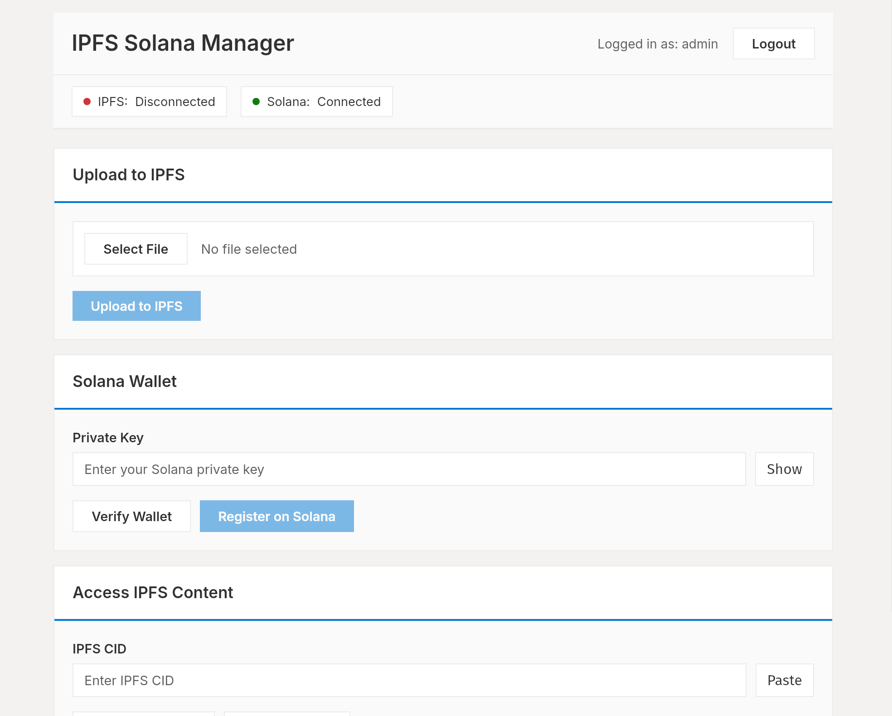

# IPFS Solana Manager

Modern desktop application for IPFS uploads and Solana blockchain transactions. Built with Tauri + Python backend.

## Features

- **Secure Login** - Auto-generated credentials with readable usernames (e.g., "swiftpanda247")
- **IPFS Upload** - Upload files to IPFS with validation
- **Zip Downloads** - Downloads automatically zipped
- **Solana Integration** - Register CIDs on blockchain
- **Professional UI** - Polished UI design with Inter font
- **Security** - bcrypt passwords, rate limiting, session management, input validation

## Quick Start

1. **Install Dependencies**
```bash
# Python dependencies
python3 -m venv venv
source venv/bin/activate
pip install -r requirements.txt

# System dependencies (Linux)
sudo apt install libwebkit2gtk-4.0-dev libgtk-3-dev librsvg2-dev

# Tauri CLI
cargo install tauri-cli
```

2. **Start IPFS Daemon**
```bash
ipfs daemon
```

3. **Run Application**
```bash
./run.sh
```

4. **First-Time Login**
   
   On first launch, the app will:
   - Generate a secure random username
   - Generate a strong 20-character random password
   - Display them **ONCE** in a modal dialog
   
   **No backup file is created** - this is intentional for security.
   
   **If you lose your credentials:**
   
   ```bash
   rm ~/.ipfs-solana-manager/users.txt
   ./run.sh  # Will generate new credentials
   ```
   
   **WARNING**: This permanently deletes all user data. No recovery possible.

## Architecture

```
backend/          # Python Flask API
├── services/     # IPFS, Solana, Auth
├── utils/        # Security, logging
└── api_server.py # Main API

src/              # Frontend (HTML/CSS/JS)
src-tauri/        # Tauri desktop wrapper
```

## Configuration

- **API Server**: `http://127.0.0.1:8765`
- **Frontend**: `http://localhost:3000`
- **Solana**: Devnet
- **Data**: `~/.ipfs-solana-manager/`

## Security Features

- **Strong Password Hashing**: bcrypt with 12 rounds (not reversible)
- **Random Credentials**: Auto-generated on first launch for maximum security
- **Rate Limiting**: 5 failed login attempts = 15 minute lockout
- **Session Management**: 24-hour token expiration
- **Memory Clearing**: Private keys cleared after use
- **Input Validation**: File size limits (100MB), extension whitelist, path traversal protection
- **CORS Protection**: Only localhost origins allowed
- **CSP Headers**: Content Security Policy configured
- **No Password Recovery**: Lost credentials require app reset

### Why This Security Model?

This is a **local desktop application**, not a web service:
- No remote access needed
- User has physical access to the machine
- Similar security model to cryptocurrency wallets
- One-time credential generation prevents weak passwords
- No "forgot password" attack vector

### Security Trade-offs

**Pros:**
- Strongest possible passwords (20+ random characters)
- No password reuse risk
- No brute-force attacks (rate limiting)
- Credentials never transmitted over network
- **No recovery backdoor** to exploit

**Cons:**
- User must save credentials externally
- Lost credentials = reset required
- No account recovery mechanism

This is intentional - **security over convenience** for crypto operations.

### Security Assumptions

This application assumes:
- You have legitimate physical access to this machine
- Your operating system is secured (password, encryption)
- You protect your Solana private keys externally
- **Physical security is YOUR responsibility**

**If laptop is stolen:** Attacker with physical access could reset the app.
Your real security is protecting private keys in a hardware wallet or password manager.

## Schreenshot



## Development

```bash
# Run tests
python -m pytest

# Debug mode
FLASK_DEBUG=1 python backend/api_server.py

# Build for production
cd src-tauri && cargo tauri build
```

## License

MIT
